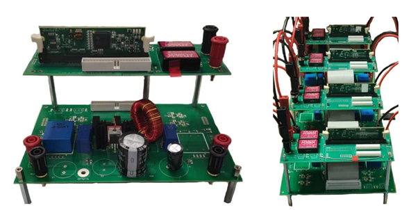
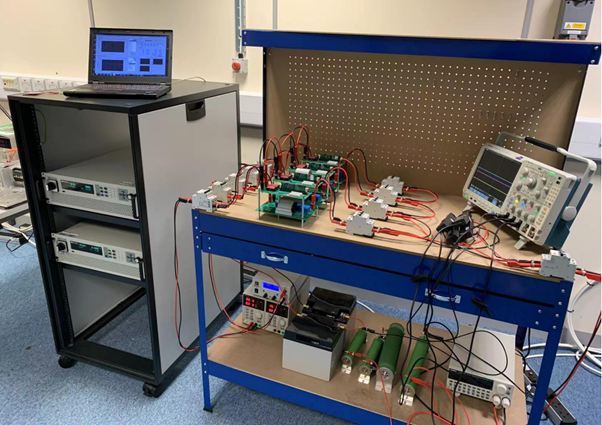

# Low-Voltage DC Microgrid Test Bench

This repository contains the **hardware design, schematics, and system description** of a **low-voltage DC microgrid experimental bench**.  
The platform was developed to validate converter design, hierarchical control strategies, and system-level energy management in DC microgrids.

The test bench includes:

- A **DC microgrid backbone**
- Four **bidirectional interface converters** (Boost / Bidirectional Boost)
- **PV emulator**, **battery banks**, and **DC grid emulator**
- **Electronic load**, resistive load banks, and measurement instruments
- Fully isolated **control + power boards** based on TI **TMS320F28335 DSP**

The platform supports both **grid-connected** and **islanded** operation and allows emulation of realistic renewable generation and dynamic load conditions.

---

## System Overview

The DC microgrid test bench consists of:

- Four interface converters  
- PV emulator  
- Battery banks  
- DC power supply (grid emulator)  
- Electronic load  
- Resistive load banks  
- PC-based monitoring & control interface  

Supported operating modes:

- **Grid-connected mode**
- **Islanded mode**

---

## Hardware Architecture

### 1. Power Board

The power board integrates:

- Bidirectional boost converter  
- Current and voltage sensing  
- MOSFET gate drivers  
- Analog signal-conditioning circuits (differential amplifiers, filters)

**Key Components**

- **MOSFET:** FDP42AN15A0  
- **Current transducer:** CASR 6-NP  
- **Voltage sensor:** LV25-P  
- **Gate driver:** HCPL-3120  
- **Isolated power supply:** TMA1515S  
- **Operational amplifier:** LM224  

---

### 2. Control Board

Includes:

- **TI DSP TMS320F28335** controller  
- TRACO isolated DC/DC modules  
- ± supply rails for sensors, gate drivers, and analog circuitry  
- (V2 only) **Wireless communication module** for converter-to-converter networking  

**Key Components**

- TRACO **TEN 5-4812WI**  
- TRACO **IL1205S**  
- TRACO **IL1215S**  
- TI **TMS320F28335** control card  

---

## Distributed Source Connections

The complete experimental setup uses **four converters**, configured as follows:

| Converter # | Source | Power Flow Mode |
|-------------|--------|-----------------|
| 1 | Grid-side (DC supply + soaking resistor) | Bidirectional |
| 2 | Battery Bank A | Bidirectional |
| 3 | Battery Bank B | Bidirectional |
| 4 | PV Emulator | Unidirectional (Boost) |

### Grid Emulation
- The DC supply provides grid-side voltage  
- A **10 Ω** soaking resistor dissipates returned power  

### Battery Storage
- Two **12 V / 24 Ah** lead-acid batteries in series → 24 V  
- Used for islanded operation & bidirectional power testing  

### PV Emulator
- Voltage output: **0–40 V**  
- Maximum power: **150 W**  

### Converter Electrical Parameters

- Input capacitor: **470 µF**  
- Inductor: **240 µH**  
- Output capacitor: **470 µF**  
- Rated power: **250 W**  
- Topology: **Bidirectional Boost Converter**

---

## Gallery

---

### Bench Version 1 (V1)

A **100 W bidirectional boost converter** was developed as the first version of the DC microgrid interface converter.  
The DC bus voltage of this bench is **48 V**.  

Supported control functions include:

- **MPPT** for PV sources  
- **Battery three-stage charging**  
- **Droop control** for power sharing  
- Real-time voltage and current regulation  

    

---

### Bench Version 2 (V2)

The second version significantly improves converter performance, including:

- Reduced switching ringing  
- Increased power rating from **100 W → 500 W** per converter  
- Improved gate drive design and sensing accuracy  
- Enhanced control board with **wireless communication support**, enabling converters to exchange information directly  

The upgraded V2 experimental DC microgrid bench is shown below.

    

---

### Entire Test Bench Setup

    

---

## Author

**Fulong Li**,  
Loughborough University  
*(Add your GitHub/website link here if desired)*

---

## License

This project is licensed under the **Creative Commons — CC BY 4.0**, see [LICENSE.md](LICENSE.md).

This project is copyrighted by:

**© 2019–2022 Fulong Li.**

